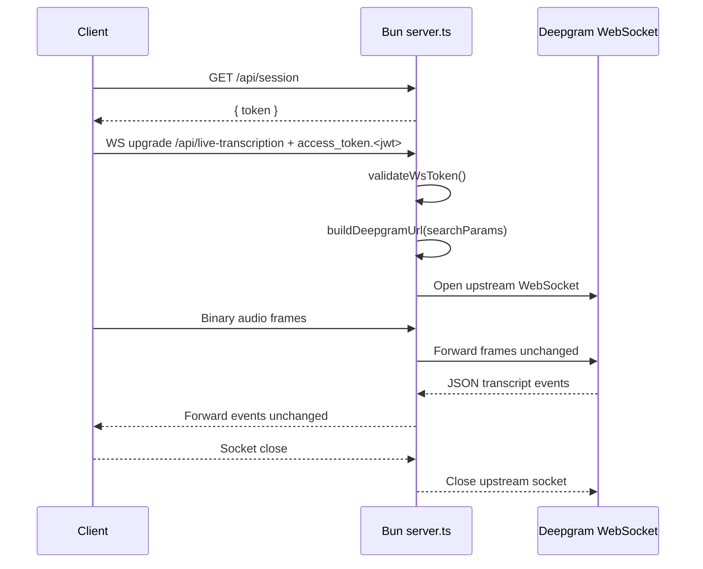
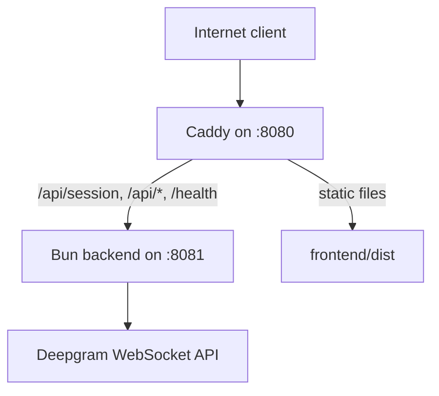

The repository is intentionally narrow: `server.ts` contains the entire backend runtime, while `deepgram.toml`, `sample.env`, `Makefile`, and `deploy/` provide operational metadata and deployment support. There is no exported library API. The public surface is the network contract exposed by the Bun server.

```mermaid
graph TD
  Browser[Browser or client app] -->|GET /api/session| BunServer[Bun server.ts]
  Browser -->|GET /api/metadata| BunServer
  Browser -->|WS /api/live-transcription| BunServer
  BunServer -->|validateWsToken()| JWT[SESSION_SECRET JWT validation]
  BunServer -->|buildDeepgramUrl()| DGURL[Deepgram listen URL builder]
  DGURL --> Deepgram[Deepgram /v1/listen WebSocket]
  Deepgram -->|transcript JSON| BunServer
  Browser -->|audio frames| BunServer
  BunServer -->|binary audio| Deepgram
  BunServer -->|CORS JSON routes| Browser
  BunServer -->|read deepgram.toml| Metadata[Starter metadata]
```

## Module Layout

The internal layout is simple enough to read top-to-bottom:

- `server.ts` defines environment validation, server configuration, auth helpers, CORS helpers, HTTP route handlers, WebSocket lifecycle hooks, and graceful shutdown logic.
- `deepgram.toml` stores starter metadata and lifecycle commands. `handleMetadata()` reads its `[meta]` section at request time.
- `sample.env` documents the runtime environment variables the server expects.
- `Makefile` wraps local-development workflows such as `make init`, `make start`, and `make test`.
- `deploy/Caddyfile`, `deploy/Dockerfile`, and `deploy/start.sh` describe the production topology: Bun runs the backend process, while Caddy serves the built frontend and reverse-proxies API traffic.

## Key Design Decisions

### One-file backend

The backend is kept in a single `server.ts` module. That lowers startup complexity for starter-project users, and it matches the repo's goal: show the minimum production-relevant Bun code needed to proxy live transcription. Instead of hiding behavior behind layers of abstractions, the route handlers and WebSocket hooks are all visible in one place.

### Bun-native HTTP and WebSocket handling

`const server = Bun.serve<WsData>({...})` is the central architectural choice. The `fetch()` handler manages HTTP routing and WebSocket upgrades, while the `websocket` object handles `open`, `message`, and `close` lifecycle events. This avoids bringing in Express, Fastify, or the Node `ws` package for a workflow Bun already supports directly.

### JWT on the browser-facing socket, Deepgram token on the upstream socket

The browser must not receive the Deepgram API key. The code therefore splits authentication into two layers:

- `handleGetSession()` mints a short-lived JWT signed with `SESSION_SECRET`.
- `validateWsToken()` accepts only `Sec-WebSocket-Protocol` values containing `access_token.<jwt>`.
- `buildDeepgramUrl()` adds the real Deepgram credential as `token=<DEEPGRAM_API_KEY>` on the upstream URL.

This design keeps the browser credential scoped to the starter server, while the Deepgram credential stays server-side. The comment in `buildDeepgramUrl()` explains why the upstream authentication happens through query params: Bun's native `WebSocket` constructor does not support setting custom headers for this connection path.

### Transparent proxying instead of message translation

The `message(ws, message)` handler forwards inbound client frames straight to `deepgramWs.send(message)`. The Deepgram `"message"` listener does the reverse with `ws.send(event.data as string | Buffer)`. That means the server does not transform audio frames, buffer partial transcripts, or impose its own message schema. The proxy stays generic and low-latency.

### Connection tracking for shutdown

`activeConnections` is a `Set<{ close(): void }>` populated in `websocket.open()` and drained in `websocket.close()`. `gracefulShutdown()` iterates that set, closes remaining sockets, stops the Bun server, and exits the process. That is a deliberate reliability trade-off: the repo accepts slightly more lifecycle code in exchange for predictable shutdown behavior under `SIGTERM`, `SIGINT`, uncaught exceptions, and unhandled rejections.

## Request And Data Lifecycle



The lifecycle starts in `fetch(req, server)`. HTTP routes are handled first: `OPTIONS` returns `204`, `GET /api/session` and `GET /api/metadata` return JSON, `GET /health` returns `{ status: "ok" }`, and everything else falls through to `404`. Only when `url.pathname === "/api/live-transcription"` does the code attempt a WebSocket upgrade.

After upgrade, Bun stores `queryParams` and `deepgramWs` on `ws.data`. `websocket.open()` uses those saved query params to construct the upstream Deepgram URL. That is why the upgrade happens before the Deepgram socket is opened: the Bun connection becomes the durable state container for the request.

## Deployment Topology

The production deployment files add one more layer around the Bun server:



`deploy/Caddyfile` rate-limits `/api/session` more aggressively than general `/api/*` traffic, proxies `/health` for Fly.io checks, and serves built frontend files from `/app/frontend/dist`. `deploy/start.sh` starts Bun in the background and keeps Caddy in the foreground so the container lifetime is tied to the reverse proxy process.

## Why This Shape Works

This starter is opinionated in the right places:

- It is small enough to audit quickly.
- It hides the Deepgram key without over-engineering auth.
- It leaves transcription payloads untouched so advanced clients can consume native Deepgram events.
- It couples local development and deployment concerns to plain files rather than code-generation steps.

If you need more policy enforcement, tenant isolation, message normalization, or analytics, this architecture is the right starting point because the current seams are obvious: `handleGetSession()`, `validateWsToken()`, `buildDeepgramUrl()`, and the `websocket` handlers are the extension points.
