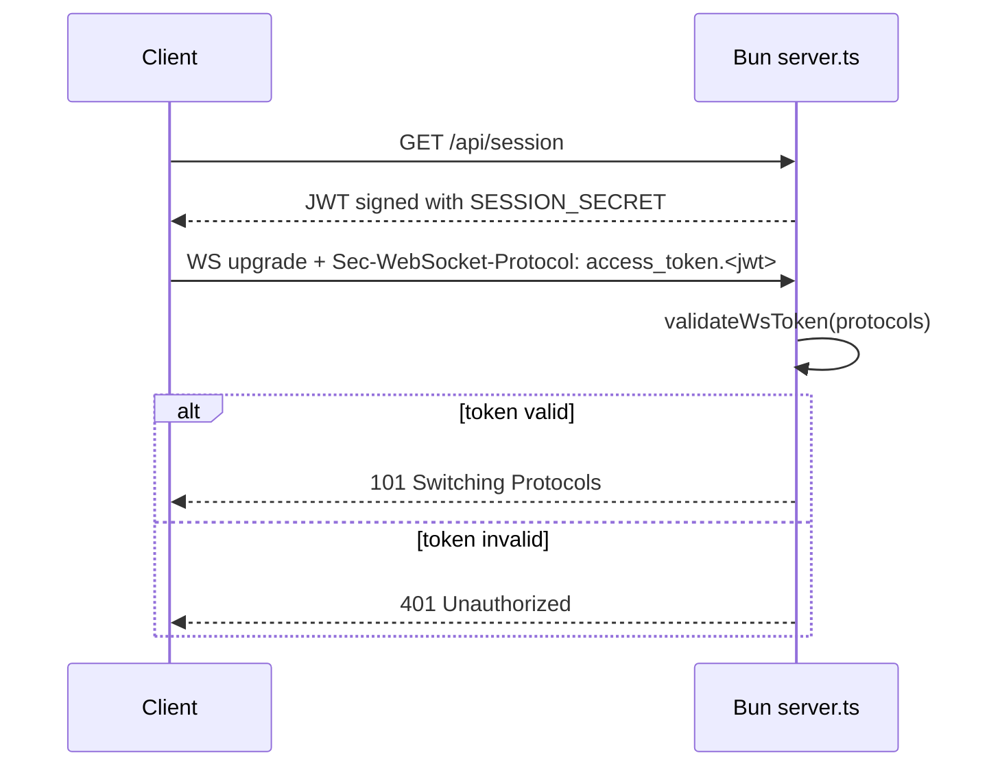

Session authentication is the first core concept in this project because the browser-facing WebSocket is intentionally not allowed to use the raw Deepgram API key. The Bun server acts as an authentication gateway: it mints a JWT through `GET /api/session`, then requires that token during the `/api/live-transcription` upgrade.

## What It Is And Why It Exists

Without an intermediate token, a frontend application would have to embed `DEEPGRAM_API_KEY` directly in browser code or make unsigned requests to the Bun server. Neither is acceptable for a production-ready starter. The code in `server.ts` solves this by introducing a short-lived session token with a one-hour expiry:

```typescript
const SESSION_SECRET =
  process.env.SESSION_SECRET || crypto.randomBytes(32).toString("hex");

const JWT_EXPIRY = "1h";
```

That design gives you a credential that is safe to hand to the browser and cheap to validate on every WebSocket upgrade.

## How It Relates To The Rest Of The System

- `handleGetSession()` issues the token.
- `validateWsToken()` validates the subprotocol header during upgrade.
- `buildDeepgramUrl()` remains responsible for the actual Deepgram credential and never exposes it to the client.
- The WebSocket proxy lifecycle depends on auth succeeding first; no Deepgram connection is opened until the JWT is accepted.

## How It Works Internally

The authentication flow lives entirely in `server.ts`:

1. `handleGetSession()` signs a JWT with `jsonwebtoken.sign`.
2. The client sends the token as a WebSocket subprotocol named `access_token.<jwt>`.
3. `fetch(req, server)` checks for the `/api/live-transcription` path and extracts `sec-websocket-protocol`.
4. `validateWsToken(protocols)` splits the header on commas, trims each entry, and searches for the `access_token.` prefix.
5. If `jwt.verify()` succeeds, the server upgrades the connection and echoes the accepted subprotocol back through the response headers.
6. If verification fails, the server returns `401 Unauthorized` before a WebSocket exists.



The actual validator is intentionally narrow:

```typescript
function validateWsToken(protocols: string | null): string | null {
  if (!protocols) return null;
  const list = protocols.split(",").map((s) => s.trim());
  const tokenProto = list.find((p) => p.startsWith("access_token."));
  if (!tokenProto) return null;
  const token = tokenProto.slice("access_token.".length);
  try {
    jwt.verify(token, SESSION_SECRET);
    return tokenProto;
  } catch {
    return null;
  }
}
```

The function returns the full matched subprotocol rather than a boolean because Bun needs that value when it upgrades the socket:

```typescript
headers: {
  "Sec-WebSocket-Protocol": validProto,
}
```

That keeps the negotiated protocol aligned with what the client requested.

## Basic Usage Example

This browser snippet obtains a token and uses it immediately:

```typescript
async function connect() {
  const { token } = await fetch("http://localhost:8081/api/session").then(
    (res) => res.json() as Promise<{ token: string }>
  );

  const ws = new WebSocket(
    "ws://localhost:8081/api/live-transcription?model=nova-3&language=en&encoding=linear16&sample_rate=16000&channels=1",
    [`access_token.${token}`]
  );

  ws.onopen = () => console.log("authenticated socket is open");
}

connect();
```

## Advanced Usage Example

Some clients negotiate more than one subprotocol. The server code handles this because it scans a comma-separated list and picks the one beginning with `access_token.`:

```typescript
async function connectWithExtraProtocols() {
  const { token } = await fetch("http://localhost:8081/api/session").then(
    (res) => res.json() as Promise<{ token: string }>
  );

  const protocols = ["json-events", `access_token.${token}`];
  const ws = new WebSocket(
    "ws://localhost:8081/api/live-transcription?language=es&encoding=linear16&sample_rate=16000&channels=1",
    protocols
  );

  ws.onopen = () => console.log("connected with multiple protocols offered");
  ws.onerror = () => console.error("upgrade rejected");
}
```

In practice, the token subprotocol still has to be present exactly as the server expects. Any other protocol names are ignored for auth purposes.

<Callout type="warn">`SESSION_SECRET` defaults to a new random value on every process start. That is convenient locally, but it means all previously issued tokens become invalid after every restart. In production, set a stable `SESSION_SECRET` or you will see intermittent `401 Unauthorized` responses during deploys and restarts.</Callout>

## Trade-Offs

<Accordions>
<Accordion title="Random startup secret vs fixed deployment secret">
The fallback `crypto.randomBytes(32).toString("hex")` is a sensible local-development default because it removes one setup step and still protects the socket route from anonymous access. The trade-off is operational stability: tokens minted before a restart are guaranteed to fail validation after the process comes back up. In a production system, a stable `SESSION_SECRET` keeps deploys and autoscaling events from invalidating active client sessions. If you need multi-instance deployments, a shared secret is not optional, because different instances must be able to verify the same token.
</Accordion>
<Accordion title="JWT in subprotocol vs credentials in query parameters">
Using the WebSocket subprotocol for the session token keeps the browser-facing URL cleaner and avoids placing the JWT in logs that capture query strings. It also matches the implementation detail in `validateWsToken()`, which explicitly inspects `sec-websocket-protocol`. The downside is client ergonomics: some browser abstractions expose query strings more clearly than protocol lists, so developers have to remember the exact `access_token.<jwt>` format. The server compensates by rejecting invalid upgrades early, but the contract is still stricter than a generic header-based auth flow.
</Accordion>
</Accordions>

## Common Extension Points

If you need more than simple session issuance, the current code gives you clear places to extend:

- Add claims in `handleGetSession()` for tenant IDs or rate-limiting buckets.
- Replace the anonymous payload `{ iat: ... }` with a real subject claim.
- Enforce additional checks inside `validateWsToken()`, such as issuer or audience validation.
- Reject stale client versions by encoding version metadata into the token and inspecting it before upgrade.

Those changes stay localized because auth is isolated from the transport proxy itself.
