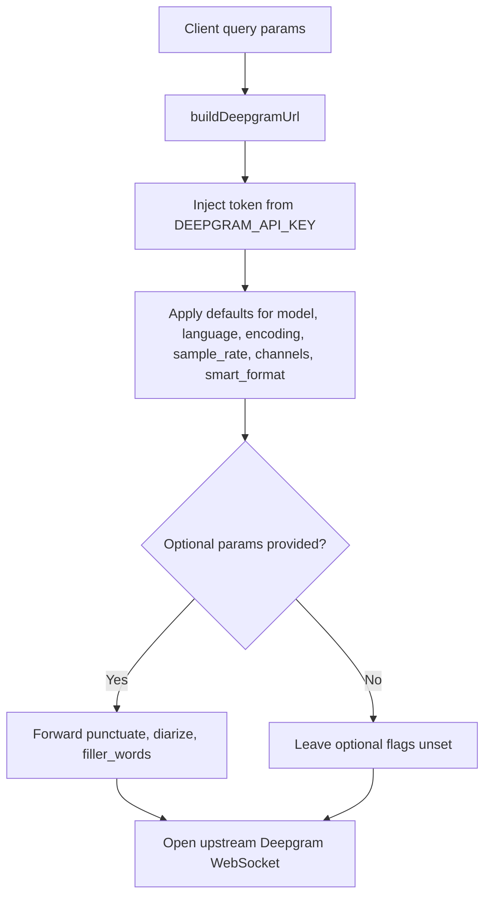

The third core concept is configuration by query string. The starter does not expose a server-side configuration object for transcription jobs. Instead, clients provide URL query parameters on `/api/live-transcription`, and `buildDeepgramUrl(queryParams)` maps those onto the upstream Deepgram WebSocket URL.

## What It Is And Why It Exists

Real-time transcription sessions differ by language, model, encoding, channel count, and formatting preferences. For a starter, query parameters are the lightest-weight way to make those settings adjustable without introducing a persistent session store or a large request schema.

The key function is:

```typescript
function buildDeepgramUrl(queryParams: URLSearchParams): string
```

It constructs a new `URL(CONFIG.deepgramSttUrl)`, adds authentication, applies defaults, and conditionally forwards optional features.

## How It Relates To Other Concepts

- [Session Authentication](/docs/session-auth) decides whether the client may connect at all.
- [WebSocket Proxy](/docs/websocket-proxy) uses the URL returned by `buildDeepgramUrl()` to open the upstream socket.
- The public query-parameter contract is documented in [Live Transcription WebSocket](/docs/api-reference/live-transcription-websocket).

## How It Works Internally

The function sets six defaulted parameters and three optional ones:

```typescript
deepgramUrl.searchParams.set("token", CONFIG.deepgramApiKey);
deepgramUrl.searchParams.set("model", queryParams.get("model") || "nova-3");
deepgramUrl.searchParams.set("language", queryParams.get("language") || "en");
deepgramUrl.searchParams.set("encoding", queryParams.get("encoding") || "linear16");
deepgramUrl.searchParams.set("sample_rate", queryParams.get("sample_rate") || "16000");
deepgramUrl.searchParams.set("channels", queryParams.get("channels") || "1");
deepgramUrl.searchParams.set("smart_format", queryParams.get("smart_format") || "true");
```

Then it forwards optional parameters only when they are present on the client request:

```typescript
const punctuate = queryParams.get("punctuate");
const diarize = queryParams.get("diarize");
const fillerWords = queryParams.get("filler_words");

if (punctuate !== null) deepgramUrl.searchParams.set("punctuate", punctuate);
if (diarize !== null) deepgramUrl.searchParams.set("diarize", diarize);
if (fillerWords !== null) deepgramUrl.searchParams.set("filler_words", fillerWords);
```

That distinction is deliberate. Defaults are opinionated enough to make the starter work out of the box, while optional toggles remain opt-in so clients control when extra processing is requested.



## Basic Usage Example

The default path is intentionally simple. If you provide only the minimum audio settings, the server fills in the rest:

```typescript
const params = new URLSearchParams({
  encoding: "linear16",
  sample_rate: "16000",
  channels: "1",
});

const ws = new WebSocket(
  `ws://localhost:8081/api/live-transcription?${params.toString()}`,
  [`access_token.${token}`]
);
```

The server expands that to a Deepgram URL that includes `model=nova-3`, `language=en`, and `smart_format=true`.

## Advanced Usage Example

For higher-control sessions, send the optional toggles explicitly:

```typescript
const params = new URLSearchParams({
  model: "nova-3",
  language: "en-US",
  encoding: "linear16",
  sample_rate: "16000",
  channels: "1",
  smart_format: "true",
  punctuate: "true",
  diarize: "true",
  filler_words: "false",
});

const ws = new WebSocket(
  `ws://localhost:8081/api/live-transcription?${params.toString()}`,
  [`access_token.${token}`]
);
```

This pattern is what you would use when your frontend exposes toggles for readability and speaker-aware transcripts.

<Callout type="warn">`encoding`, `sample_rate`, and the actual audio bytes must agree. The server does not resample or transcode audio. If your client sends audio that is not really `linear16` at `16000` Hz while the query string claims it is, Deepgram receives mismatched data and transcript quality will degrade or fail outright.</Callout>

## Trade-Offs

<Accordions>
<Accordion title="Safe defaults vs explicit client control">
The defaults in `buildDeepgramUrl()` are strong enough to make the starter usable immediately with a browser microphone pipeline, which is why `model`, `language`, `encoding`, `sample_rate`, `channels`, and `smart_format` all have fallback values. The trade-off is that defaults can mask mistakes during integration, especially when a client forgets to send a parameter and silently gets `nova-3` or `en`. That is fine for a starter, but if your product relies on strict session settings, you may want to validate required params before opening the upstream socket. The current implementation favors convenience over strictness.
</Accordion>
<Accordion title="Passing query params through vs enforcing a server-side allowlist">
Forwarding a curated set of query params keeps the backend easy to reason about and prevents the server from becoming a generic tunnel for every possible Deepgram option. It also creates a clean seam for product decisions, because the backend explicitly names each supported setting in `buildDeepgramUrl()`. The downside is maintenance: adding new Deepgram features requires code changes on both the client and the server. That is still a reasonable trade-off because it prevents accidental exposure of unsupported or unsafe combinations.
</Accordion>
</Accordions>

## Extending The Option Set

If you want to add another Deepgram option, the pattern is already established:

1. Read the parameter from `url.searchParams` on the client.
2. Add it to the browser's `URLSearchParams`.
3. Read it in `buildDeepgramUrl(queryParams)`.
4. Conditionally forward it to `deepgramUrl.searchParams`.

Because this function is isolated, option growth does not require changes elsewhere in the server unless the new option affects auth or lifecycle behavior.
