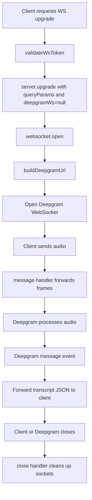

The WebSocket proxy is the core runtime abstraction in this repository. The Bun server is not transcribing audio itself. Its job is to accept an authenticated client WebSocket, open a corresponding Deepgram WebSocket, and move bytes and messages between them with as little interference as possible.

## What It Is And Why It Exists

Live transcription needs a continuous transport:

- upstream audio from the client,
- downstream transcript events from Deepgram,
- predictable cleanup when either side disconnects.

The project implements that transport in the `websocket` section of `Bun.serve<WsData>({...})`. This is why the repo feels more like a gateway than a library: the network lifecycle is the product.

## How It Relates To Other Concepts

- It depends on [Session Authentication](/docs/session-auth) to protect the upgrade path.
- It uses [Transcription Options](/docs/transcription-options) to determine which Deepgram URL to open.
- It exposes the runtime contract documented in [Live Transcription WebSocket](/docs/api-reference/live-transcription-websocket).

## How It Works Internally

The WebSocket lifecycle has three main stages:

1. Upgrade and attach `WsData`.
2. Open the upstream Deepgram socket.
3. Forward frames until one side closes.

The `WsData` interface shows what Bun stores per connection:

```typescript
interface WsData {
  queryParams: URLSearchParams;
  deepgramWs: WebSocket | null;
}
```

Once `fetch(req, server)` upgrades the connection, `websocket.open(ws)` executes. It adds the client socket to `activeConnections`, reads the saved query params, constructs the Deepgram URL, and opens a native `WebSocket`:

```typescript
const params = ws.data.queryParams;
const deepgramUrl = buildDeepgramUrl(params);
const deepgramWs = new WebSocket(deepgramUrl);
ws.data.deepgramWs = deepgramWs;
```

From that point, the proxy is symmetrical:

- `message(ws, message)` forwards client-sent audio to `deepgramWs.send(message)`.
- The Deepgram `"message"` event forwards `event.data` back to the client with `ws.send(...)`.
- If Deepgram errors, the server closes the client socket with code `1011`.
- If the client disconnects, `close(ws, code, reason)` closes the upstream socket with code `1000`.



## Why The Proxy Is Transparent

The code deliberately avoids parsing or rewriting Deepgram responses. That has two consequences:

1. You receive native Deepgram events on the client, including interim and final transcript payloads.
2. The backend remains thin and low-latency because it does not maintain transcript state or message schemas of its own.

This is visible in the message handlers:

```typescript
message(ws, message) {
  const deepgramWs = ws.data.deepgramWs;
  if (deepgramWs && deepgramWs.readyState === WebSocket.OPEN) {
    deepgramWs.send(message);
  }
}
```

```typescript
deepgramWs.addEventListener("message", (event) => {
  try {
    ws.send(event.data as string | Buffer);
  } catch {
    // Client may have disconnected
  }
});
```

There is no schema translation layer in between.

## Basic Usage Example

This example shows a browser client that sends pre-encoded audio frames and logs transcript events:

```typescript
async function startStreaming(audioFrames: Int16Array[]) {
  const { token } = await fetch("http://localhost:8081/api/session").then(
    (res) => res.json() as Promise<{ token: string }>
  );

  const ws = new WebSocket(
    "ws://localhost:8081/api/live-transcription?model=nova-3&language=en&encoding=linear16&sample_rate=16000&channels=1",
    [`access_token.${token}`]
  );

  ws.onopen = () => {
    for (const frame of audioFrames) {
      ws.send(frame.buffer);
    }
  };

  ws.onmessage = (event) => {
    console.log("deepgram event", JSON.parse(String(event.data)));
  };
}
```

## Advanced Usage Example

In a real application, you should coordinate socket state with teardown and reconnection logic. The server will close the upstream Deepgram socket when the client closes, so the client should make that lifecycle explicit too:

```typescript
async function connectWithCleanup(onTranscript: (event: unknown) => void) {
  const { token } = await fetch("http://localhost:8081/api/session").then(
    (res) => res.json() as Promise<{ token: string }>
  );

  const ws = new WebSocket(
    "ws://localhost:8081/api/live-transcription?language=en&encoding=linear16&sample_rate=16000&channels=1&punctuate=true",
    [`access_token.${token}`]
  );

  ws.onmessage = (event) => onTranscript(JSON.parse(String(event.data)));
  ws.onclose = (event) => {
    console.log(`proxy closed: ${event.code} ${event.reason}`);
  };

  return {
    sendFrame(frame: ArrayBuffer) {
      if (ws.readyState === WebSocket.OPEN) {
        ws.send(frame);
      }
    },
    stop() {
      if (ws.readyState === WebSocket.OPEN || ws.readyState === WebSocket.CONNECTING) {
        ws.close(1000, "user requested stop");
      }
    },
  };
}
```

<Callout type="warn">The proxy only forwards audio when the upstream Deepgram socket is already open. If your client starts pushing frames immediately on `CONNECTING`, those frames are dropped because `message(ws, message)` checks `deepgramWs.readyState === WebSocket.OPEN`. Wait for `ws.onopen` on the client side before sending audio.</Callout>

## Trade-Offs

<Accordions>
<Accordion title="Transparent forwarding vs server-side normalization">
Transparent forwarding keeps the Bun server fast and easy to audit because it does not parse every Deepgram event or buffer audio chunks. The trade-off is that every client must understand Deepgram's native message format and handle partial versus final transcripts on its own. If you wanted a consistent product-specific event schema across multiple backends, you would introduce a normalization layer here, but that would increase latency and code complexity. The current implementation is a better fit for a starter because it preserves flexibility for advanced consumers.
</Accordion>
<Accordion title="One upstream WebSocket per client vs multiplexing">
Each connected client gets its own `deepgramWs` instance stored in `ws.data.deepgramWs`. That model is simple, avoids cross-talk between sessions, and mirrors how live audio conversations actually work. The downside is resource usage: high concurrency means high upstream connection counts. For a starter and most interactive transcription use cases, one-to-one mapping is the correct trade-off because it keeps error handling and lifecycle cleanup obvious.
</Accordion>
</Accordions>

## Failure Behavior

The implementation handles failure conservatively:

- Deepgram `"error"` closes the client socket with code `1011` and reason `"Deepgram connection error"`.
- Deepgram `"close"` propagates its close code and reason to the client.
- Client `"close"` shuts down the upstream Deepgram connection with code `1000`.
- Process-level failures trigger `gracefulShutdown()` and close every tracked client connection.

That behavior matters when you deploy behind a reverse proxy. The Bun server owns cleanup rather than assuming the client or platform will do it correctly.
